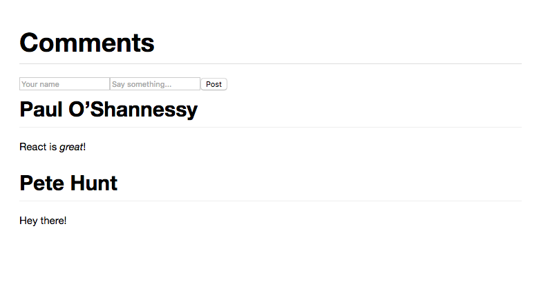

[](https://heroku.com/deploy)

# React Tutorial



This is mostly the same as the React comment box example from [the React tutorial](http://facebook.github.io/react/docs/tutorial.html). The main difference is that it's been modified to show the comment form at the top of the screen (instead of the bottom) and the list of previous comments are displayed in reverse order so the most recent comment appears at the top.

## To use

There are several simple server implementations included. They all serve static files from `public/` and handle requests to `/api/comments` to fetch or add data. Start a server with one of the following:

### Node

```sh
npm install
node server.js
```

### Python

```sh
pip install -r requirements.txt
python server.py
```

### Ruby
```sh
ruby server.rb
```

### PHP
```sh
php server.php
```

### Go
```sh
go run server.go
```

### Perl

```sh
cpan Mojolicious
perl server.pl
```

And visit <http://localhost:3000/>. Try opening multiple tabs!

## Changing the port

You can change the port number by setting the `$PORT` environment variable before invoking any of the scripts above, e.g.,

```sh
PORT=3001 node server.js
```
